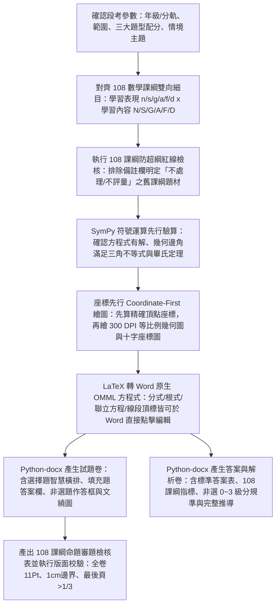

# 國高中數學科 108 課綱素養命題規範與自動化產卷技能 (jhsh-math-exam-generator)

本 Skill 專門用於指導 Antigravity 代理人自動化命題，生成完全符應「新北市立錦和高級中學」教務處/試務組規範，且深度結合**教育部《十二年國民基本教育課程綱要—數學領域（108 課綱）》**（核心素養、學習表現、學習內容、備註欄防超綱界線、學習評量實施要點）、國教院素養導向紙筆測驗要素與國際 PISA 數學評量架構之正式數學段考試題卷、答案與解析卷，以及命題審題雙向細目檢核表。

---

## 快速開始：使用者提詞標準模板 (User Prompt Template)

> [!TIP]
> **若使用者不知道如何下指令或初次使用本技能，請主動告知並引導使用者複製以下虛擬範例模板並依當次範圍修改：**

```text
請使用 /jhsh-math-exam-generator 技能為我生成一份數學科段考試卷，規格參數如下：
1、年級與範圍：【請填寫年級與章節，例如：八年級下學期 第 1 章「等差數列與等差級數」到 第 2 章「一次函數及其圖形」】。
2、題型與配分：總分 100 分
   - 第一部分：單一選擇題【例如：12 題，每題 4 分，共 48 分】
   - 第二部分：填充題【例如：10 格，每格 4 分，共 40 分，請於卷末附填充題標準答案欄】
   - 第三部分：非選擇題（計算與證明題）【例如：2 題，每題 6 分，共 12 分，附作答區方框】
3、難易程度：【例如：難易適中（預估平均通過率約 60%～65%，兼顧基本概念熟練與多步驟素養推論）】。
4、圖形與公式要求：所有代數分式、根號、聯立方程與幾何線段符號請使用 Word 原生可編輯 OMML 方程式；幾何題與座標題請繪製 300 DPI 高清黑白向量圖並採右側浮動文繞圖排版。
5、其它：【選填，例如：嚴格遵守 108 數學課綱防超綱限制，並以 Python SymPy 100% 自動驗算確認條件無矛盾且答案唯一】。
```

---

## 核心工作流程 (Workflow)



---

## 一、 錦和高中數學科試務組排版與題型標準規範

生成 Word (`.docx`) 檔案時，**必須嚴格遵循以下排版規則**：

1. **試題抬頭（粗體加底線）**：
   - 格式：<u>**新北市立錦和高級中學 11X學年度第X學期 [國中/高中]部○年級數學科第○次段考試題**</u>
   - 包含：﹝命題範圍：...﹞、右上角標註「班級：____ 座號：__ 姓名：________」。
2. **必放注意事項（警語）**：
   - 答案卡警語（紅色粗體）：「**答案卷(卡)未寫班級、姓名、座號，或畫卡錯誤致電腦無法判讀考生身份者，一律扣 5 分**」。
   - 非選／填充警語：「**填充題與非選擇題請用黑色墨水筆於答案卷規定欄位內作答，違者扣該部分總分 5 分；非選擇題需寫出完整計算或推論過程才予計分**」。
3. **數學科三大標準題型與版面設計**：
   - **第一部分：單一選擇題**：
     - 題號凸排（`left_indent = 0.28 inch, first_line_indent = -0.28 inch`）。
     - **選項智慧並排規範（極致省紙）**：
       - 若四個選項皆為簡短數值、單純代數式或短詞（長度 $\le 10$ 字元，且未附右側浮動圖）：一律採用**「四選一列橫排」**（以全形空白或定位點對齊：`(A) ...　　(B) ...　　(C) ...　　(D) ...`）。
       - 若選項為中等長度多項式或根式（長度 $11 \sim 22$ 字元，且未附右側浮動圖）：採用**「兩選一列（2×2）」**。
       - 若選項為長句敘述，或該題**附有右側浮動文繞圖**：四個選項一律採**「單列排列（1 option per line）」**，避免與右側圖片擠壓折行。
   - **第二部分：填充題**：
     - 題幹挖空處使用標準底線加格號，例如：`________(1)________` 或 `【 (1) 】`（全卷填充格號可採 `①、②、③` 或 `(1)、(2)、(3)` 連續編號）。
     - **自動產生「填充題作答欄表格」**：於試題卷適當處（或獨立答案卷頂部）自動繪製帶框線的標準作答表格（每列 4～5 格，標明格號與留白高度 $\ge 1.2\text{ cm}$，供學生填入分式或根式答案）。
   - **第三部分：非選擇題（計算與證明題）**：
     - 每題通常包含 `(1)`、`(2)` 兩個循序漸進的子題（第一小題基礎建模/求解，第二小題進階推論/幾何證明或最佳化決策）。
     - 於試題卷（或答案卷）自動繪製**「非選擇題作答區方框」**（高度約 $4.5 \sim 6.0\text{ cm}$），供學生書寫完整推導過程。
4. **版面設定（Page Margins & Fonts）**：
   - **頁邊界**：上、下、左、右各 **1.0 cm**（0.3937 英吋）。
   - **字體**：中文一律使用 **標楷體**，英文變數與數字使用 **Times New Roman**，原生數學方程式使用 **Cambria Math**。
   - **字體大小**：試卷主標題 13.5～14 Pt 粗體底線；大題標題 11.5 Pt 粗體；**全卷正文、題幹、選項、方程式、題組短文與解析一律嚴格維持 11 點字 (11 Pt)**；圖說 9.5 Pt；頁尾動態頁碼 10 Pt。
   - **行距與防裁切**：段落行距設為 `1.15` 倍行距（含繁分數或多重根號之段落不鎖定固定行高，確保分子分母上下標完整顯示不截斷）。
   - **最後一頁控制**：最後一頁內容不可少於整頁的 1/3。

---

## 二、 Word 原生可編輯數學方程式引擎 (Native OMML `<m:oMath>`)

> [!IMPORTANT]
> **嚴禁將複雜數學公式寫成純文字（如 `(-b±√(b^2-4ac))/(2a)`），亦嚴禁將公式轉成 PNG 圖片插入！**
> 必須使用 Word 原生 **OMML (Office Math Markup Language, `<m:oMath>`)** 寫入段落，讓審題與命題教師在 Word 中點兩下即可直接修改分子、分母、根號與上下標！

### 1. 數學符號與方程式分級處理原則
- **第一級（行內輕量幾何與關係符號）**：
  - 角度 $\angle A = 60^\circ$、三角形 $\triangle ABC$、全等 $\cong$、相似 $\sim$、垂直 $\perp$、平行 $\parallel$、不等號 $\le, \ge, \neq$、圓周率 $\pi$、正負號 $\pm$、乘號 $\times$、除號 $\div$：可直接使用標準 Unicode 數學字元搭配斜體變數。
- **第二級（必須使用 Word 原生 `<m:oMath>` 物件之結構化數學式）**：
  - **分式（Fractions）**：如 $\frac{3x-1}{2} - \frac{x+4}{3} = 1$、繁分數。
  - **根式（Radicals）**：平方根 $\sqrt{a^2+b^2}$、高次方根 $\sqrt[3]{x}$、雙重根號 $\sqrt{5+2\sqrt{6}}$。
  - **上下標與次方（Superscripts / Subscripts）**：多項式 $3x^3 - 5x^2 + 2x - 7$、數列 $a_n = a_1 + (n-1)d$、排列組合 $C^n_k, P^n_k$、對數 $\log_2 8$。
  - **幾何頂標符號（Overbars / Arcs / Vectors）**：線段 $\overline{AB}$、弧 $\overset{\frown}{AB}$、向量 $\vec{u}$、直線 $\overleftrightarrow{AB}$。
  - **聯立方程組與分段函數（Cases / Delimiters）**：$\begin{cases} 3x + 2y = 12 \\ 2x - y = 1 \end{cases}$、絕對值 $|2x-5|$、矩陣與行列式。

### 2. Python 原生 OMML 數學方程式建構器（核心標準程式庫）

在撰寫產卷腳本時，直接引入以下 **零外部 XSLT 依賴之純 Python OMML 建構器**，即可在任何段落中透過簡單標記或函式直接插入原生 Word `<m:oMath>` 方程式：

```python
from docx.oxml import parse_xml
from docx.oxml.ns import nsdecls

MATH_NS = 'xmlns:m="http://schemas.openxmlformats.org/officeDocument/2006/math" xmlns:w="http://schemas.openxmlformats.org/wordprocessingml/2006/main"'

def m_run(text, italic=True):
    """建立 OMML 數學文字節點 <m:r>，預設變數斜體、數字與運算子正體"""
    sty = '<m:rPr><m:sty m:val="p"/></m:rPr>' if not italic else ''
    # 轉義 XML 特殊字元
    esc = str(text).replace("&", "&amp;").replace("<", "&lt;").replace(">", "&gt;")
    return f'<m:r>{sty}<w:rPr><w:rFonts w:ascii="Cambria Math" w:hAnsi="Cambria Math" w:eastAsia="標楷體"/><w:sz w:val="22"/></w:rPr><m:t>{esc}</m:t></m:r>'

def m_frac(num_xml, den_xml):
    """建立原生分數 <m:f>：num_xml / den_xml"""
    return f'<m:f><m:num>{num_xml}</m:num><m:den>{den_xml}</m:den></m:f>'

def m_sqrt(base_xml, deg_xml=None):
    """建立原生根號 <m:rad>：若 deg_xml 為 None 則為平方根，否則為 n 次方根"""
    if deg_xml is None:
        return f'<m:rad><m:radPr><m:degHide m:val="1"/></m:radPr><m:deg/><m:e>{base_xml}</m:e></m:rad>'
    return f'<m:rad><m:radPr><m:degHide m:val="0"/></m:radPr><m:deg>{deg_xml}</m:deg><m:e>{base_xml}</m:e></m:rad>'

def m_sup(base_xml, sup_xml):
    """建立原生上標/次方 <m:sSup>：base^{sup}"""
    return f'<m:sSup><m:e>{base_xml}</m:e><m:sup>{sup_xml}</m:sup></m:sSup>'

def m_sub(base_xml, sub_xml):
    """建立原生下標 <m:sSub>：base_{sub}"""
    return f'<m:sSub><m:e>{base_xml}</m:e><m:sub>{sub_xml}</m:sub></m:sSub>'

def m_subsup(base_xml, sub_xml, sup_xml):
    """建立原生上下標 <m:sSubSup>：如 C_k^n 或積分上下限"""
    return f'<m:sSubSup><m:e>{base_xml}</m:e><m:sub>{sub_xml}</m:sub><m:sup>{sup_xml}</m:sup></m:sSubSup>'

def m_bar(base_xml, pos="top"):
    """建立幾何線段頂線 <m:bar>：\overline{AB}"""
    return f'<m:bar><m:barPr><m:pos m:val="{pos}"/></m:barPr><m:e>{base_xml}</m:e></m:bar>'

def m_acc(base_xml, chr_val="&#x20D7;"):
    """建立頂部裝飾符號 <m:acc>：預設向量箭頭 &#x20D7;，圓弧可用 &#x2322;"""
    return f'<m:acc><m:accPr><m:chr m:val="{chr_val}"/></m:accPr><m:e>{base_xml}</m:e></m:acc>'

def m_cases(*eq_xml_list):
    """建立聯立方程組左大括號 <m:d> + <m:eqArr>"""
    rows = "".join([f'<m:e>{eq}</m:e>' for eq in eq_xml_list])
    return f'<m:d><m:dPr><m:begChr m:val="{{"/><m:endChr m:val=""/></m:dPr><m:e><m:eqArr>{rows}</m:eqArr></m:e></m:d>'

def m_delim(inner_xml, left="(", right=")"):
    """建立自動縮放括號或絕對值 <m:d>：如 ( ... ) 或 | ... |"""
    return f'<m:d><m:dPr><m:begChr m:val="{left}"/><m:endChr m:val="{right}"/></m:dPr><m:e>{inner_xml}</m:e></m:d>'

def append_omath(paragraph, inner_omml_xml):
    """將組裝好的 OMML 字串轉為原生 <m:oMath> 物件並附加至 Word 段落中"""
    omath_str = f'<m:oMath {MATH_NS}>{inner_omml_xml}</m:oMath>'
    paragraph._p.append(parse_xml(omath_str))
```

> [!TIP]
> **進階自動轉換**：若環境已安裝 `latex2mathml` 與 `lxml`，亦可搭配通用 LaTeX 解析器，將題幹字串中的 `$...$` 自動切分，中文部分以 11pt 標楷體 `add_run()` 寫入，`$...$` 數學式部分自動轉為 `<m:oMath>` 嵌入同一段落，實現圖文與公式行內無縫混排！

---

## 三、 「座標先行 (Coordinate-First)」300 DPI 幾何與函數繪圖引擎

數學科的幾何與函數圖形**絕對不能憑感覺手繪或讓比例失真**。必須嚴格遵守以下幾何與座標繪圖規範：

### 1. 數學幾何繪圖五大鐵律
1. **強制等比例鎖定（Equal Aspect Ratio）**：
   - 凡是平面幾何圖（三角形、圓、四邊形、扇形），**必須執行 `ax.set_aspect('equal')` 且隱藏外框座標軸 `ax.axis('off')`**，確保圓形必為正圓、正方形必為正方、直角視覺上必為 $90^\circ$（若題目特別設計為非精確比例之純推理示意圖，依 108 數學課綱實施要點五之(八)規範，必須在圖旁明確加註「（本圖僅供參考／示意圖）」）。
2. **「座標先行（Coordinate-First）」計算原則**：
   - 繪圖前必須先透過數學公式（畢氏定理、餘弦定理、直線交點、圓參數式 $(r\cos\theta, r\sin\theta)$）計算出所有頂點的精確 $(x, y)$ 浮點座標，再傳入繪圖函式。
3. **頂點字母外推防壓線演算法（Smart Vertex Offset）**：
   - 幾何頂點標籤（如 $A, B, C, D, O, P$）**嚴禁直接畫在頂點座標 $(x, y)$ 上導致壓線**！必須計算該頂點相對於圖形重心（或角平分線反方向）的單位外推向量 $\vec{n}$，將文字錨定於 $(x + d\cdot n_x, y + d\cdot n_y)$，並採用 **斜體 Times New Roman（18～20 Pt 粗斜體）**。
4. **中學數學幾何專屬標記（必備視覺語言）**：
   - **直角記號（Right-Angle Marker $\llcorner$）**：垂直交點必須繪製邊長約總圖寬 $4\%\sim 5\%$ 的正交小折線方框。
   - **角度圓弧與度數標籤（Angle Arc）**：已知角或所求角需繪製小圓弧，並在弧外標註 $60^\circ$、$120^\circ$ 或 $x^\circ$。
   - **等長記號（Tick Marks）與平行記號（Parallel Arrows）**：等腰或全等條件需在線段中點畫垂直短刻線（單槓/雙槓）；平行線需畫方向箭頭。
   - **求面積之塗色／斜線區域（Shaded Region）**：求弓形、扇形或重疊面積時，一律使用 **淺灰底色（`facecolor='#D8D8D8'`）搭配黑白斜線填充（`hatch='///'` 或 `'\\\\'`，`edgecolor='black'`）**，確保試務組高速黑白油印後依然層次分明。
5. **標準十字直角座標系（Cartesian Plane）**：
   - 繪製一次函數、二次函數拋物線、座標平面幾何時，**嚴禁使用預設的四邊封閉方框（Box Spines）**！
   - 必須將 `left` 與 `bottom` 軸移動至原點 $(0,0)$（`ax.spines['left'].set_position('zero')`, `ax.spines['bottom'].set_position('zero')`），隱藏 `top` 與 `right`，並在 $x$ 軸右端與 $y$ 軸上端加上實心箭頭，於交點左下方標註原點 $O$。

### 2. 可直接複用之 Python 數學幾何繪圖核心函式庫

```python
import numpy as np
import matplotlib.pyplot as plt
import matplotlib.patches as patches

plt.rcParams['font.sans-serif'] = ['Microsoft JhengHei', 'DFKai-SB']
plt.rcParams['axes.unicode_minus'] = False

def draw_right_angle(ax, vertex, p1, p2, size=0.35, lw=1.8):
    """在 vertex 處繪製指向 p1 與 p2 的標準直角記號 (小方框)"""
    v = np.array(vertex, dtype=float)
    u1 = np.array(p1, dtype=float) - v
    u2 = np.array(p2, dtype=float) - v
    u1 = u1 / np.linalg.norm(u1) * size
    u2 = u2 / np.linalg.norm(u2) * size
    c1 = v + u1
    c2 = v + u1 + u2
    c3 = v + u2
    ax.plot([c1[0], c2[0], c3[0]], [c1[1], c2[1], c3[1]], color='black', lw=lw)

def draw_angle_arc(ax, vertex, p1, p2, radius=0.6, label=None, fontsize=17):
    """在 vertex 處繪製從 p1 到 p2 (逆時針) 的角度圓弧與度數標籤"""
    v = np.array(vertex, dtype=float)
    d1 = np.array(p1, dtype=float) - v
    d2 = np.array(p2, dtype=float) - v
    ang1 = np.degrees(np.arctan2(d1[1], d1[0])) % 360
    ang2 = np.degrees(np.arctan2(d2[1], d2[0])) % 360
    if (ang2 - ang1) % 360 > 180:
        ang1, ang2 = ang2, ang1
    arc = patches.Arc(v, 2*radius, 2*radius, angle=0, theta1=ang1, theta2=ang2, color='black', lw=1.8)
    ax.add_patch(arc)
    if label:
        mid_ang = np.radians(ang1 + ((ang2 - ang1) % 360) / 2.0)
        lx = v[0] + (radius * 1.48) * np.cos(mid_ang)
        ly = v[1] + (radius * 1.48) * np.sin(mid_ang)
        ax.text(lx, ly, label, fontsize=fontsize, ha='center', va='center', fontweight='bold')

def draw_tick_marks(ax, p1, p2, num_ticks=1, tick_len=0.22, spacing=0.12, lw=1.8):
    """在線段 p1-p2 中點繪製等長記號 (單槓/雙槓/三槓)"""
    p1, p2 = np.array(p1, float), np.array(p2, float)
    mid = (p1 + p2) / 2.0
    tangent = (p2 - p1) / np.linalg.norm(p2 - p1)
    normal = np.array([-tangent[1], tangent[0]])
    offsets = np.linspace(-(num_ticks-1)*spacing/2, (num_ticks-1)*spacing/2, num_ticks)
    for off in offsets:
        center = mid + off * tangent
        a = center - (tick_len / 2) * normal
        b = center + (tick_len / 2) * normal
        ax.plot([a[0], b[0]], [a[1], b[1]], color='black', lw=lw)

def label_vertex(ax, pt, name, center_ref=(0, 0), offset=0.42, fontsize=19):
    """沿著遠離圖形中心 center_ref 的方向自動外推標註頂點字母，絕不壓線"""
    pt = np.array(pt, float)
    c = np.array(center_ref, float)
    vec = pt - c
    norm = np.linalg.norm(vec)
    unit = vec / norm if norm > 1e-6 else np.array([0.0, 1.0])
    pos = pt + unit * offset
    ax.text(pos[0], pos[1], f"${name}$", fontsize=fontsize, ha='center', va='center', fontweight='bold')

def setup_cartesian_axes(ax, xlim=(-5, 5), ylim=(-5, 5)):
    """設定標準中學數學十字直角座標系 (含原點 O 與 x, y 軸箭頭)"""
    ax.set_xlim(xlim)
    ax.set_ylim(ylim)
    ax.set_aspect('equal')
    ax.spines['left'].set_position('zero')
    ax.spines['bottom'].set_position('zero')
    ax.spines['right'].set_color('none')
    ax.spines['top'].set_color('none')
    ax.spines['left'].set_linewidth(1.8)
    ax.spines['bottom'].set_linewidth(1.8)
    ax.plot(xlim[1], 0, ">k", markersize=8, clip_on=False)
    ax.plot(0, ylim[1], "^k", markersize=8, clip_on=False)
    ax.text(xlim[1] + 0.3, -0.1, "$x$", fontsize=19, fontweight='bold', va='center')
    ax.text(0.15, ylim[1] + 0.3, "$y$", fontsize=19, fontweight='bold', ha='center')
    ax.text(-0.35, -0.4, "$O$", fontsize=17, fontweight='bold')
```

---

## 四、 SymPy 符號運算 100% 自動驗算防錯機制 (Mandatory Verification)

> [!CAUTION]
> **數學試卷絕對零容忍「無解題」、「條件矛盾題」或「四個選項皆非正解」！**
> 在將試題寫入 Word 檔之前，代理人**必須先撰寫並執行一段 Python `SymPy` 驗算腳本**，通過以下四大檢核：

1. **代數與方程驗算**：使用 `sympy.solve()` 或 `sympy.simplify()` 驗證每一道代數化簡、因式分解、聯立方程、根式運算之標準答案百分之百正確。
2. **幾何存在性驗算**：
   - 凡給定三角形三邊長 $a, b, c$，必檢驗 $a+b > c, a+c > b, b+c > a$。
   - 凡給定直角三角形、圓內接四邊形、弦心距與切線段長，必檢驗畢氏定理與圓幾何性質是否精確成立，不可湊出互相矛盾的多餘條件（Over-determined contradiction）。
3. **選項唯一性與誘答合理性檢核**：
   - 確認單選題四個選項 `(A)(B)(C)(D)` 數值互異，且**恰好只有一個選項恆等於 `SymPy` 解出之正解**。
   - 其餘三個誘答選項應設計為「常見計算迷思」（例如：完全平方公式漏掉中間項 $2ab$、移項忘記變號、去括號未分配負號、直徑誤當半徑代入）。
4. **配分與選項均衡檢核**：
   - 選擇題之 `(A)(B)(C)(D)` 正解次數必須均衡分佈（各約占 $25\%$）。
   - 全卷各大題配分皆為整數，且總和嚴格等於 $100$ 分。

---

## 五、 教育部《十二年國民基本教育數學領域 108 課綱》核心規範與命題防超綱體系

本技能完整內建教育部《十二年國民基本教育課程綱要—國民中小學暨普通型高級中等學校—數學領域》之法定規範。代理人於設計每一道試題、撰寫詳解及產出「命題審題檢核表」時，必須嚴格對齊以下課綱體系：

### 1. 數學領域基本理念與核心素養（三面九項指標）

- **五大基本理念**：
  1. **數學是一種語言**：宜由自然語言的題材導入，逐步進行形式化與抽象化轉換。
  2. **數學是一種實用的規律科學**：強調觀察、歸納、推理與建立數學模型解決問題。
  3. **數學是一種人文素養**：連結文化、歷史與美感（惟數學史背景僅作情境鋪陳，不得考歷史記憶題）。
  4. **數學教育應提供有感的學習機會**：連結學生生活經驗與跨領域情境，兼顧直觀與嚴謹。
  5. **培養學生正確使用工具的素養**：包含直尺、三角板、量角器、圓規與計算機之合理運用及誤差認識。

- **數學領域核心素養編碼對照表（審題檢核表必填）**：

| 核心素養面向與項目 | 國民中學教育（第四學習階段 `數-J`） | 普通型高級中等學校教育（第五學習階段 `數S-U`） |
| :--- | :--- | :--- |
| **A1 身心素質與自我精進** | **`數-J-A1`**：對於學習數學有信心和正向態度，能使用適當的數學語言進行溝通，並能將所學應用於日常生活中。 | **`數S-U-A1`**：具備從數、量、形、不確定性及關係的觀點，觀察周邊事物並思索其本質的習慣；體會邏輯與推理的意涵與價值。 |
| **A2 系統思考與解決問題** | **`數-J-A2`**：具備有理數、根式、坐標系之運作能力，並能以符號代表數或幾何物件，執行運算與推論，在生活或想像情境中分析本質以解決問題。 | **`數S-U-A2`**：具備數學模型的基本工具，以數學模型解決典型的現實問題。了解數學在觀察歸納之後還須演繹證明的思維特徵及其價值。 |
| **A3 規劃執行與創新應變** | **`數-J-A3`**：具備識別現實生活問題和數學的關聯的能力，可從多元、彈性角度擬定問題解決計畫，並能將問題解答轉化於真實世界。 | **`數S-U-A3`**：具備規劃及執行以數學觀點探究與解決問題的能力，在探索中發展新的概念，並能將解答轉化為應變策略。 |
| **B1 符號運用與溝通表達** | **`數-J-B1`**：具備處理代數與幾何中數學關係的能力，並用以描述情境中的現象。能在經驗範圍內，以數學語言表述平面與空間的基本關係和性質。能以基本的統計量與機率，描述生活中不確定性的程度。 | **`數S-U-B1`**：具備描述狀態、關係、運算的數學符號素養，掌握符號與日常語言的輔成價值；並能根據此符號執行操作程序，陳述情境問題並呈現操作或推論過程。 |
| **B2 科技資訊與媒體素養** | **`數-J-B2`**：具備正確使用計算機以增進學習的素養，包含知道其適用性與限制、認識其作為數學探究之工具，並能辨識與證實媒體中的數學資訊。 | **`數S-U-B2`**：具備正確使用計算機與電腦軟體以增進學習的素養，理解數值計算的誤差與限制，善用科技工具探索函數圖形、統計數據與空間幾何，並批判解讀媒體統計資訊。 |
| **B3 藝術涵養與美感素養** | **`數-J-B3`**：具備辨認藝術作品中的幾何形體或數量關係的素養，並能在數學的推導中，逐漸發展審美、簡潔、敏銳的觀察力。 | **`數S-U-B3`**：具備感知藝術作品與大自然中比例、對稱、週期、透視等數學結構與規律的美感素養，並欣賞數學推理與形式之簡潔美。 |
| **C1 道德實踐與公民意識** | **`數-J-C1`**：具備從數學證據出發，贊成或反對某個主張的態度，提升對倫理與民主議題的思辨能力。 | **`數S-U-C1`**：具備以客觀數據、統計推論與邏輯論證檢視公共議題（如環境、能源、公衛風險、社會公平）的公民素養。 |
| **C2 人際關係與團隊合作** | **`數-J-C2`**：樂於與他人分享自己的解題方法與思路，並能尊重與欣賞他人的不同解法，在合作中共同解決問題。 | **`數S-U-C2`**：具備運用數學語言與團隊成員溝通模型假設、推導步驟與結論限制的能力，透過合作提升問題解決效能。 |
| **C3 多元文化與國際理解** | **`數-J-C3`**：認識不同文化中的數學發展與貢獻，理解數學作為跨文化共通語言的特性，並能以全球視野關心國際議題中的數據資訊。 | **`數S-U-C3`**：理解數學在不同文化脈絡中的演進與普世價值，並能運用數學建模與統計工具分析全球性議題。 |

---

### 2. 「學習表現」六大類別編碼與認知層次定義

108 數學課綱將「學習表現」分為 6 大類別，編碼格式為 **`[表現類別]-[學習階段]-[流水號]`**：
- **第 1 碼（表現類別）**：
  - **`n`**：數與量（Number and Measurement）
  - **`s`**：空間與形狀（Space and Shape）
  - **`g`**：坐標幾何（Coordinate Geometry）
  - **`a`**：代數（Algebra）
  - **`f`**：函數（Functions）
  - **`d`**：資料與不確定性（Data and Uncertainty）
- **第 2 碼（學習階段）**：
  - **`IV`**：第四學習階段（國民中學 7～9 年級）
  - **`V`**：第五學習階段（高級中等學校 10～12 年級）

#### 課綱法定認知動詞階層（調控試題難度之依據）：
1. **認識（Recognize）**：由具體經驗或操作察覺數學物件與基本性質，**命題應以直觀辨識、基本概念判讀為主，嚴禁針對標註「認識」之條目出繁複計算或高難度證明題**。
2. **理解（Understand）**：掌握數學概念間的邏輯關聯、能做表徵轉換並說明理由。
3. **熟練（Procedural Fluency）**：能正確且有效率地執行關鍵數學程序（如：有理數四則運算、一次方程式求解、基本乘法公式與因式分解）。
4. **應用與解題（Apply & Problem Solving）**：能將日常「具體情境」或跨學科問題轉化為數學式進行求解並詮釋結果。
5. **報讀（Read & Interpret Data）**：能正確讀取統計圖表、盒狀圖、折線圖之數據資訊並進行合理推論。

#### 第四學習階段（國中 7～9 年級）關鍵學習表現條目速查：
- **數與量 (`n-IV`)**：
  - `n-IV-1` 理解因數、倍數、質數、最大公因數、最小公倍數的意義及熟練其計算，並能運用到日常生活的情境解決問題。
  - `n-IV-2` 理解負數之意義、符號以及在數線上的表現方式，並能熟練含負數之整數、分數、小數的四則運算。
  - `n-IV-3` 理解非負整數次方的指數和指數律，應用於質因數分解與科學記號，並能運用到日常生活的情境解決問題。
  - `n-IV-4` 理解比、比例式、正比、反比和連比的意義和推理，並能運用到日常生活的情境解決問題。
  - `n-IV-5` 理解二次方根的意義、符號與根式的四則運算，並能運用到日常生活的情境解決問題。
  - `n-IV-6` 應用十分逼近法估算二次方根的近似值，並能應用計算機計算、驗證與估算，建立對二次方根的數感。
  - `n-IV-7` 辨識數列的規律性，以數學符號表徵生活中的數量關係與規律，認識等差數列與等比數列，並能依首項與公差或公比計算其他各項。
  - `n-IV-8` 理解等差級數的求和公式，並能運用到日常生活的情境解決問題。
  - `n-IV-9` 使用計算機計算比值、複雜的數式、小數或根式等四則運算與三角比的近似值問題，並能理解計算機可能產生誤差。
- **空間與形狀 (`s-IV`)**：
  - `s-IV-1` 理解常用幾何形體的定義、符號、性質，並應用於幾何問題的解題。
  - `s-IV-2` 理解角的各種性質、三角形與凸多邊形的內角和外角的意義、三角形的外角和、與凸多邊形的內角和，並能應用於解決幾何與日常生活的問題。
  - `s-IV-3` 理解兩條直線的垂直和平行的意義，以及各種性質，並能應用於解決幾何與日常生活的問題。
  - `s-IV-4` 理解平面圖形全等的意義，知道圖形經平移、旋轉、鏡射後仍保持全等，並能應用於解決幾何與日常生活的問題。
  - `s-IV-5` 理解線對稱的意義和線對稱圖形的幾何性質，並能應用於解決幾何與日常生活的問題。
  - `s-IV-6` 理解平面圖形相似的意義，知道圖形經縮放後其圖形相似，並能應用於解決幾何與日常生活的問題。
  - `s-IV-7` 理解畢氏定理與其逆敘述，並能應用於數學解題與日常生活的問題。
  - `s-IV-8` 理解特殊三角形（如正三角形、等腰三角形、直角三角形）、特殊四邊形（如正方形、矩形、平行四邊形、菱形、箏形、梯形）和正多邊形的幾何性質及相關問題。
  - `s-IV-9` 理解三角形的邊角關係，利用邊角對應相等，判斷兩個三角形的全等，並能應用於解決幾何與日常生活的問題。
  - `s-IV-10` 理解三角形相似的性質，利用對應角相等或對應邊成比例，判斷兩個三角形的相似，並能應用於解決幾何與日常生活的問題。
  - `s-IV-11` 理解三角形重心、外心、內心的意義和其相關性質。
  - `s-IV-12` 理解直角三角形中某一銳角的角度決定邊長的比值，認識這些比值的符號，並能運用到日常生活的情境解決問題。
  - `s-IV-13` 理解直尺、圓規操作過程的敘述，並應用於尺規作圖。
  - `s-IV-14` 認識圓的相關概念（如半徑、弦、弧、弓形等）和幾何性質（如圓心角、圓周角、圓外一點到圓的切線段長等），並理解弧長、圓面積、扇形面積的公式。
  - `s-IV-15` 認識線與線、線與平面在空間中的垂直關係和平行關係。
  - `s-IV-16` 理解簡單的立體圖形及其三視圖與平面展開圖，並能計算立體圖形的表面積、側面積及體積。
- **坐標幾何 (`g-IV`)**：
  - `g-IV-1` 認識直角坐標的意義與構成要素，並能報讀與標示坐標點，以及計算兩個坐標點的距離。
  - `g-IV-2` 在直角坐標上能描繪與理解二元一次方程式的直線圖形，以及二元一次聯立方程式唯一解的幾何意義。
- **代數 (`a-IV`)**：
  - `a-IV-1` 理解並應用符號及文字敘述表達概念、運算、推理及證明。
  - `a-IV-2` 理解一元一次方程式及其解的意義，能以等量公理與移項法則求解和驗算，並能運用到日常生活的情境解決問題。
  - `a-IV-3` 理解一元一次不等式的意義，並應用於日常生活的情境解決問題。
  - `a-IV-4` 理解二元一次聯立方程式及其解的意義，並能以代入消去法與加減消去法求解和驗算，以及能運用到日常生活的情境解決問題。
  - `a-IV-5` 認識多項式及相關名詞，並熟練多項式的四則運算及運用乘法公式。
  - `a-IV-6` 理解一元二次方程式及其解的意義，能以因式分解和配方法求解和驗算，並能運用到日常生活的情境解決問題。
- **函數 (`f-IV`)**：
  - `f-IV-1` 理解常數函數和一次函數的意義，能描繪常數函數和一次函數的圖形，並能運用到日常生活的情境解決問題。
  - `f-IV-2` 理解二次函數的意義，並能描繪二次函數的圖形。
  - `f-IV-3` 理解二次函數的標準式，熟練其頂點坐標、對稱軸與極值的求法。
- **資料與不確定性 (`d-IV`)**：
  - `d-IV-1` 理解常用統計圖表，並能運用簡單統計量分析資料的特性及認識資料對統計判斷的重要性。
  - `d-IV-2` 理解機率的意義，能以機率表示不確定性和規律性，並能應用機率到簡單的日常生活情境解決問題。

---

### 3. 「學習內容」7～12 年級條目架構與【嚴格防超綱紅線清單】

> [!CAUTION]
> **108 課綱最重要之命題紀律：嚴格遵守課綱「備註欄」明定之「不處理／不評量／已移至高年級」邊界！**
> 許多傳統參考書或考古題仍殘留九年一貫舊課綱題型，代理人命題時**絕對禁止跨越以下各年級紅線**：

#### （1）國中 7 年級（`N-7`, `S-7`, `G-7`, `A-7`, `D-7`）命題範疇與禁區
- **核心條目**：`N-7-1~9`（質因數分解、最大公因數與最小公倍數、負數與四則運算、數線與絕對值、整數/分數底數之非負整數次方指數律、科學記號、比與比例式/正反比/連比）、`S-7-1~5`（簡單圖形與幾何符號、三視圖、垂直與平分、線對稱圖形、尺規作圖）、`G-7-1`（平面直角坐標系）、`A-7-1~8`（代數符號、一元一次方程式、二元一次聯立方程式及其圖形、一元一次不等式）、`D-7-1~2`（統計圖表、平均數/中位數/眾數）。
- **🚫 7 年級嚴格命題禁區（不得超綱）**：
  1. **絕對值（`N-7-5`）**：僅用於記錄數線上兩點的距離（如 $|a-b|$），**嚴禁在 7 年級考「含未知數之絕對值方程式（如 $|2x-3|=5$）」或「絕對值不等式」**（已移至 10 年級 `N-10-1`）。
  2. **指數律（`N-7-6`, `N-7-7`）**：次方僅限「正整數或 0」，**嚴禁出現負整數次方（如 $2^{-3}$）或分數次方**（已移至 10 年級 `N-10-2`）。
  3. **科學記號（`N-7-8`）**：以科學與日常情境認識及比較大小為主，**不宜涉及繁複的科學記號四則運算**。
  4. **比與比例式（`N-7-9`）**：比限兩數且不含負數，**不涉及繁分數**，且**不再使用「比例尺」名詞**。
  5. **三視圖（`S-7-2`）**：小正方體堆疊限 **最多 10 個、範圍在 $3\times 3\times 3$ 以內，且不得中空**；不考由三視圖反推複雜表面積或體積。
  6. **一元一次方程式（`A-7-3`）與二元一次聯立方程式圖形（`A-7-6`）**：一元一次方程式**不處理無解或無限多解**；二元一次聯立方程式的幾何意義**只處理「兩直線相交於唯一交點」**，不處理平行無解或重合無限多解之幾何判定。
  7. **一元一次不等式（`A-7-8`）**：**僅處理「單一」的一元一次不等式**，嚴禁考聯立一元一次不等式或連續不等式（如 $2 < 3x-1 \le 8$）。

#### （2）國中 8 年級（`N-8`, `S-8`, `G-8`, `A-8`, `F-8`, `D-8`）命題範疇與禁區
- **核心條目**：`N-8-1~6`（二次方根與近似值、根式四則運算、等差數列、等差級數、等比數列）、`S-8-1~12`（角與尺規作圖、凸多邊形內角和、平行線截角性質、全等圖形與三角形全等性質 SSS/SAS/ASA/AAS/RHS、線對稱性質、畢氏定理、三角形邊角關係、平行四邊形與特殊四邊形、尺規作圖）、`G-8-1`（直角坐標上兩點距離公式）、`A-8-1~7`（二次式乘法公式、多項式意義與四則運算、因式分解、一元二次方程式及其解法與應用）、`F-8-1~2`（一次函數與常數函數及其圖形）、`D-8-1`（累積次數、相對次數與累積相對次數折線圖）。
- **🚫 8 年級嚴格命題禁區（不得超綱）**：
  1. **一次函數符號（`F-8-1`）**：8 年級以變數對應關係 $y = ax + b$ 介紹一次函數與常數函數，**課綱備註明令：「不要出現 $f(x)$ 的抽象型式！」**（函數符號 $f(x)$ 已移至 10 年級 `F-10-1`）。
  2. **乘法公式（`A-8-1`）**：僅限 $(a+b)^2, (a-b)^2, (a+b)(a-b), (a+b)(c+d)$ 四個二次式公式，**嚴禁考三次乘法公式 $(a\pm b)^3, a^3\pm b^3$ 或三項和平方 $(a+b+c)^2$**（已移至 10 年級 `A-10-1`）。
  3. **多項式四則運算（`A-8-3`）**：多項式乘法結果**最高至三次**；多項式除法中**被除式最高為二次**，且**嚴禁考「分離係數法」、「綜合除法」或「餘式定理」**！
  4. **因式分解（`A-8-5`）**：十字交乘法**只處理整係數二次三項式 $ax^2+bx+c$** 或直接套用基本乘法公式者，**嚴禁考拆項添項分組分解、雙十字交乘或高次多項式因式分解**。
  5. **二次方根（`N-8-1`, `N-8-2`）**：根號內僅限正數，有理化分母限單項或簡單形如 $\frac{c}{\sqrt{a}\pm\sqrt{b}}$，**嚴禁考雙重根號化簡 $\sqrt{a\pm 2\sqrt{b}}$**（雙重根號在 10 年級 `N-10-1`）。
  6. **等差數列與等比數列（`N-8-4`, `N-8-6`）**：課綱備註明令：**不處理「已知不相鄰兩項（不含首項），反求首項、項數或公差／公比」之繁瑣反推問題**；且 8 年級**只教等比數列，不教「等比級數求和」**（等比級數在 10 年級 `N-10-7`）。
  7. **等差級數（`N-8-5`）**：課綱備註明令：**不處理「已知等差級數和，反求首項、項數或公差」之二次方程反推問題**。
  8. **凸多邊形內角和（`S-8-2`）**：理解三角形外角和與凸多邊形內角和，**不處理多邊形外角和公式之機械套用**。

#### （3）國中 9 年級（`N-9`, `S-9`, `F-9`, `D-9`）命題範疇與禁區
- **核心條目**：`N-9-1`（連比與連比例式應用）、`S-9-1~13`（相似形、三角形相似性質 AA/SAS/SSS、平行線截比例線段、相似直角三角形邊長比值/三角比初探、圓與直線位置關係與切線性質、圓心角与圓周角、三角形外心/內心/重心、幾何推理與證明、空間中的線與平面垂直平行關係、角柱/角錐/圓柱/圓錐之表面積與體積）、`F-9-1~2`（二次函數的圖形與極值）、`D-9-1~3`（全距/四分位距/盒狀圖、古典機率與兩層樹狀圖）。
- **🚫 9 年級嚴格命題禁區（不得超綱）**：
  1. **二次函數（`F-9-1`, `F-9-2`）**：9 年級聚焦於標準式 $y=a(x-h)^2+k$ 的平移、對稱軸、開口方向與頂點極值。**課綱備註明令：「二次函數的配方法（將一般式 $y=ax^2+bx+c$ 配方求頂點）」及「二次函數的應用問題」已移至 10 年級（`F-10-1`）！** 在 9 年級命題時，若求極值應給定已配方形式或可由圖形對稱點直接求得之形式。
  2. **直角三角形邊長比值／三角比（`S-9-4`）**：**在不使用計算機的紙筆段考中，角度嚴格限於 $30^\circ, 45^\circ, 60^\circ$**！嚴禁超綱考廣義角三角比、商數與平方恆等式推導、正弦定理或餘弦定理（均在 10 年級 `G-10-4~7`）。
  3. **圓的幾何性質（`S-9-5~7`）**：108 課綱已刪除舊課綱之「兩圓位置關係與內外公切線長公式」、「弦切角定理」、「圓內角／圓外角公式」及「圓冪定理（內冪、外冪、切割線定理）」，**嚴禁於 9 年級段考出現上述已刪除定理**。
  4. **幾何推理與證明（`S-9-11`）**：證明題材**以學習內容直接推理可得者為限**。
  5. **機率與樹狀圖（`D-9-2`）**：**樹狀圖以兩層及具備對稱性者為主**，嚴禁超綱使用排列組合符號 $P^n_k, C^n_k$。

#### （4）高中 10 年級（高一必修：`N-10`, `G-10`, `A-10`, `F-10`, `D-10`）命題範疇與禁區
- **核心條目**：`N-10-1~7`（實數、絕對值方程式與不等式、雙重根號、有理數指數與實數指數、常用對數與科學記號、數列與數學歸納法、級數 $\Sigma$ 與等比級數）、`G-10-1~7`（坐標圖形的對稱與平移、直線方程式與點線距離、圓方程式與圓切線、廣義角與極坐標、正弦定理、餘弦定理、三角測量）、`A-10-1~2`（三次乘法公式、多項式除法原理、綜合除法、餘式定理與因式定理）、`F-10-1~2`（函數定義與 $f(x)$ 符號、二次函數配方法與應用、三次函數標準式 $y=a(x-h)^3+p(x-h)+k$ 之對稱中心與一次近似）、`D-10-1~4`（一維數據標準差、二維數據相關係數與最小平方法迴歸直線、排列組合、古典機率）。
- **🚫 10 年級嚴格命題禁區（不得超綱）**：
  1. **多項式函數（`A-10-2`, `F-10-1`）**：108 課綱**已刪除「整係數多項式一次因式檢驗法（牛頓定理）」、「拉格朗日插值多項式」與「虛根成對定理」**（複數與虛根已移至 12 年級選修 `A-12甲-1 / A-12乙-2`）。
  2. **指數與對數（`N-10-3~5`）**：10 年級僅認識「以 10 為底的常用對數 $\log a$」及其在科學記號大數估算之應用，**嚴禁在 10 年級考一般底數對數 $\log_a b$、換底公式、對數律繁複化簡或指數/對數函數圖形**（已移至 11 年級 `N-11A-1`, `F-11A-4`, `F-11B-2`）。
  3. **三角比（`G-10-4~7`）**：10 年級不考弧度量、三角函數圖形、和差角公式、倍角與半角公式（已移至 11 年級）。

#### （5）高中 11 年級分軌（高二 `11A` 數 A vs. `11B` 數 B）與 12 年級選修（`12甲` vs. `12乙`）邊界
- **高二數 A（`11A`）**：含弧度量、三角函數圖形、和差角公式與正餘弦疊合（`F-11A-1~3`）、一般底數對數律與指對數函數（`N-11A-1`, `F-11A-4`）、平面向量內積與二階克拉瑪公式/面積行列式（`G-11A-6~7`）、空間向量內積與外積/三階行列式體積（`G-11A-1~4`）、空間平面與直線方程式及三元一次聯立方程組（`G-11A-5`, `A-11A-1`）、二階矩陣運算與平面線性變換（伸縮/旋轉/鏡射/推移 `A-11A-2~3`）、條件機率與貝氏定理（`D-11A-2~3`）。
- **高二數 B（`11B`）嚴格防跨 A 軌紅線**：
  - 數 B 著重商管、社會、文史與藝術設計應用：含弧度量與正弦函數週期模型（`N-11B-1`, `F-11B-1`，**不考和差角、倍半角與正餘弦疊合**）、按比例成長模型與連續複利 $e$（`F-11B-2`）、平面向量內積（`G-11B-1~2`）、平面設計透視比例（`G-11B-3`）、圓錐截痕視覺認識（`S-11B-2`，**不考二次曲線標準式**）、空間概念與球面經緯度坐標（`S-11B-1`, `G-11B-4`，**嚴禁考空間向量外積、三垂線定理計算、空間平面與空間直線方程式**）、矩陣資料表與二階反方陣（`A-11B-1`，**不考平面線性變換之旋轉/鏡射/推移矩陣**）、主觀/客觀機率與列聯表貝氏定理（`D-11B-1~2`）。
- **高三選修數甲（`12甲`）vs. 數乙（`12乙`）**：
  - 兩者定積分**均以多項式函數為主，嚴禁涉及「分部積分法」與「變數變換積分法」**。
  - `12甲` 涵蓋數列與函數極限、微分連鎖律（以 $(ax+b)^n$ 為主）、黎曼和與微積分基本定理、旋轉體體積、複數極式與棣美弗定理（`N-12甲-3`）、二次曲線標準式（`G-12甲-1`，不直接處理含 $xy$ 項之旋轉消去計算）、離散型隨機變數與二項/幾何分布（`D-12甲-1~2`）。
  - `12乙` 涵蓋線性規劃與平行直線系（`A-12乙-1`）、微分邊際意涵、積分總量與消費者/生產者剩餘意涵（`F-12乙-4~6`）、二項分布（`D-12乙-2`）。

---

### 4. 108 數學課綱「學習評量實施要點」與 PISA 數學素養命題架構

依據《數學領域課程綱要》陸、實施要點之「五、學習評量」與國際 PISA 數學評量架構：

1. **PISA 數學推論與問題解決四歷程（納入審題檢核表）**：
   - **M1 數學推論（Mathematical Reasoning）**：代數結構觀察、幾何性質演繹證明、反例舉證、規律歸納。
   - **M2 形成數學問題（Formulate）**：將真實生活情境（如：商場階梯式折扣、園區步道面積規劃、金融複利、球類拋物線軌跡）轉譯為代數方程式、不等式、函數或幾何模型。
   - **M3 運用數學概念與程序（Employ）**：執行多項式運算、解方程、配方、利用相似形或畢氏定理求解未知量。
   - **M4 詮釋與評鑑結果（Interpret & Evaluate）**：檢驗算出來的解在真實情境中是否合理（例如：邊長與人數必為正整數、二次方程負根捨去、比較兩種方案何者划算並說明理由）。
2. **課綱學習評量五大法定原則**：
   - **避免人工化難題與死記公式**：評量應以課綱學習重點為依據，兼顧基本程序熟練與概念理解，**避免無意義的人工化繁複計算題或與常理不符的虛假情境**。
   - **生活情境與純數學抽象形式的平衡**：全卷應同時包含「具體生活/十九項議題情境應用題」（性別平等、環境教育、海洋教育、戶外教育、金融理財、科技資訊等）與「純數學結構推理題」，不可偏廢。
   - **數學史與數學家生平不納入計分**：可以數學史（如畢氏學派、阿基米德、九章算術、黃金比例）作為題幹情境引導，但**評量核心必須是數學概念本身，嚴禁考歷史年代或人名背誦**。
   - **計算機與參考數值規範**：若試題涉及非特殊角三角比、對數近似值、平方根近似值或標準差，在不可使用計算機之一般紙筆段考中，**必須於題幹末段明確給定參考近似值表**（例如：「參考數值：$\sqrt{2}\approx 1.414, \sqrt{3}\approx 1.732, \log 2\approx 0.3010$」）。
   - **國中教育會考（CAP）與大考非選擇題 0～3 級分分段給分規準（必附於解析卷）**：
     - **3 級分**：解題策略完整合理，推論或證明過程嚴謹且最終答案完全正確。
     - **2 級分**：解題策略正確且正確列出核心關係式（或完成第一小題），惟最後計算局部失誤或未完成最終結論。
     - **1 級分**：僅能寫出部分初步關係式或正確算出單一中間量，策略未連貫。
     - **0 級分**：空白、與題意無關或策略完全錯誤。

---

## 六、 獨立三份 Word 檔案產出與自我檢核清單 (Checklist)

每次執行本技能時，必須在工作目錄產出以下 **3 份獨立 `.docx` 檔案**：
1. `[學期][年級]數學段[次]試題.docx`（含選擇題、填充題、非選題、題幹末尾章節標籤【X-Y】、浮動文繞圖、填充答案欄與非選作答框）
2. `[學期][年級]數學段[次]答案與解析.docx`（含頂部標準答案速查表、每題對應之 **108 課綱學習表現/學習內容編碼**、逐題 OMML 方程式完整推導過程、誘答迷思診斷、非選 0～3 級分評分規準）
3. `[學期][年級]數學段[次]命題審題檢核表.docx`（含 **108 數學課綱「學習表現 × 學習內容 × 核心素養」雙向細目表**、PISA 數學歷程分布、防超綱紅線自檢與試務審題檢核表）

### 產卷完畢必做檢核：
- [ ] 是否已逐題核對 **108 數學課綱「各年級嚴格防超綱紅線清單」**（例如：7 年級無絕對值方程、8 年級無 $f(x)$ 符號與分離係數法、9 年級無一般式配方法與舊課綱圓冪定理、10 年級無牛頓一次因式檢驗法）？
- [ ] 全卷分數、根號、次方、聯立方程組與幾何線段頂標是否皆已使用 **Word 原生 `<m:oMath>` (OMML)** 而非純文字拼湊？
- [ ] 是否已透過 **Python `SymPy`** 100% 驗算過每一題的標準答案與幾何條件自洽性？
- [ ] 幾何圖形是否鎖定 `ax.set_aspect('equal')`、具備直角/角度弧/等長記號，且頂點字母已外推無壓線？
- [ ] 圖表字級是否符合 **+8 Pt 特大清晰標準（16.5～21 Pt）** 且採黑白灰階/斜線填充設計？
- [ ] 附圖試題是否採用 **右側浮動「矩形文繞圖 (`wp:anchor` + `wrapSquare`)」**（寬度 2.4～2.7 英吋）？
- [ ] 選擇題短選項是否已採用「四選一列」或「兩選一列」智慧橫排以節省紙張？
- [ ] 是否包含錦和高中標準粗體底線抬頭、紅字扣 5 分警語、全卷 11 Pt 標楷體/Times New Roman、1cm 邊界、題號凸排與動態頁尾 `〔第 X 頁，共 Y 頁〕`？
- [ ] 最後一頁版面是否大於 1/3 頁？

